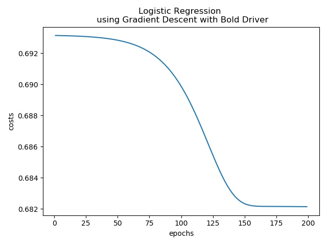

# CS777 Big Data Analytics Term Project

## Description: Using Logistic Regression to predict a stock for a buy or sell

In this project, we implement a logistic regression model to predict a stock for either a buy or sell. We use Apple history stock data as an example. We have implemented the model from scratch using pySpark and optimized the model using Gradient Descent with bold drive. In order to compare predict accuracy, we have also implemented the logistic model using MLlib library. We've got very similar accuracy using both implementations. 

## DATA
The data used are the history data of APPL stock, from 2000-12-01 to 2021-4-30. It can be downloaded from Yahoo finance. This is a time series data, containing the daily price and volume data from the stock market. 

## Define a Project

1. The dataset include six fields: Open, High, Low, Close, Adj_Close and Volume. We transformed `Adj_Close` and `Volume` data to percentage change to the previous day as the primary features, and the percentage change of `5-day future Adj_close` price as the target. 
   
2. The research question is whether we can use the history data to classify a stock to be a buy or sell. 

3. By using this model, I am expecting to use the history stock day to predict a stock whether it is a buy or sell for each day, to make an investment decision. 

4. In order to evaluate the model, we have divide the dataset into two dataset: train and test data. The train dataset will be used to train the model. The test dataset will be used to make prediction. F1 scores will be calculated to evaluating the model.
   
## Feature Engineering
Using time series historical data to predict future is very tricky. In order to make better predictions, instead of directly adding lots of historical time steps, we engineered some features by condensing information from previous time points into a single timestep with indicators. 

In this example, we have chosen `Moving Average(MA)` and `Relative Strength Indicator(RSI)` for price and volume. We have created moving averages and rsi for the time periods of 14, 30, 50, and 200 for both close price and volume data. 

## Implementation
We implemented the logistic regression using pySpark from scrath. In order to compare, we have also implemented the model using MLlib library. For the detailed implementation and code, please refer to the program file, `stock_prediction_by_logistic_regression.py`.

- training curve

  

- Prediction result
  - our own implementation from scratch
   ```angular2html
    F1 score: 0.7668133249528598
   ```
  - prediction from the model using MLlib
   ```angular2html
   F1 Score = 0.7603305785123967
   ```

## Python scripts submitted 

    - stock_prediction.py
    - plot_training.py

## Other Documents (in the docs folder)

    - console printouts from the script
    - the plot of the training curve

## How to run  

You can run the pySpark script locally as the sample data used here is small. If running on big data, you can submit the task to spark cluster.